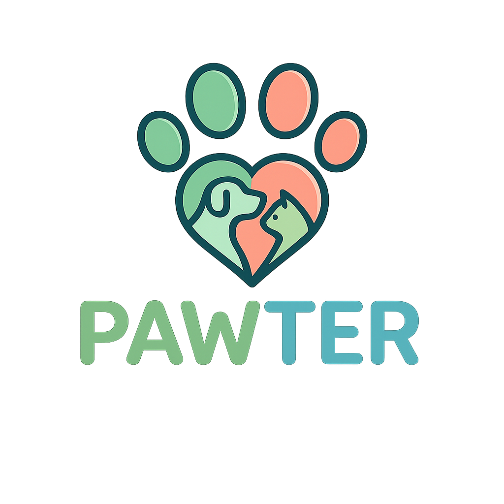
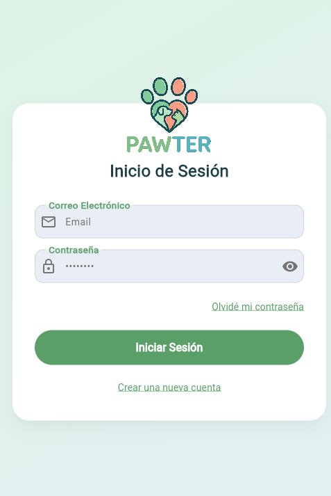
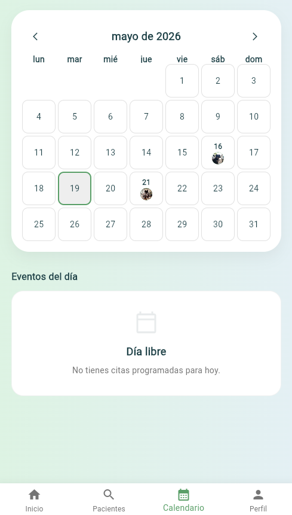
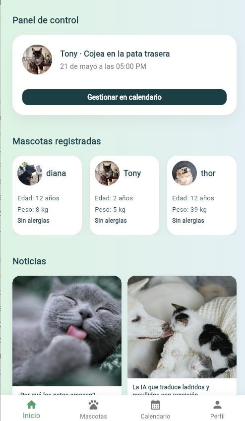
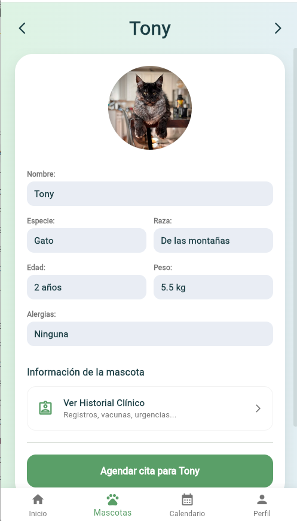

# Pawter
---
## ¿Qué es?

Pawter es una aplicación móvil desarrollada en Flutter que conecta a clientes con veterinarios. Los dueños de las mascotas pueden gestionar sus citas y el historial clínico, mientras que el veterinario tiene su propia vista de agenda y directorio de pacientes.

---

## 📲 Cómo instalar la aplicación

Para probar la aplicación en tu dispositivo Android, puedes instalar directamente el archivo APK siguiendo estos pasos:

1. *Descarga la APK:* Ve a la sección de *Releases* (Lanzamientos) en este repositorio de GitHub y descarga el archivo con extensión .apk más reciente.
2. *Permite fuentes desconocidas:* Si es la primera vez que instalas una app fuera de Google Play, tu teléfono te pedirá activar el permiso de "Instalar aplicaciones desconocidas" para tu navegador o gestor de archivos.
3. *Instalación:* Abre el archivo descargado, pulsa en *Instalar* y, una vez finalizado el proceso, ya podrás iniciar *Pawter* desde tu menú de aplicaciones.
4. *Crea un usuario:* Al crear tu usuario en el registro, ve a tu correo y verifícalo. (Es muy probable que el correo se encuentre en correos no deseados).

---

## ✨ Funcionalidades

### Para el cliente
*Citas* : reserva, consulta y cancela citas para tus mascotas 
*Ficha* : foto, datos y historial clínico de cada animal 
*Historial clínico* : consultas previas con informes descargables en PDF 
*Autenticación* : registro, login y recuperación de contraseña

### Para el veterinario
 *Agenda* : la agenda se actualiza al instante cuando un cliente reserva y permite ver lo que tiene para hoy y mañana. 
 *Pacientes* : listado completo de mascotas y sus dueños con búsqueda por nombre y email 
 *Crear consultas* : añade entradas al historial clínico de cualquier mascota

---

## 🛠️ Tecnologías

| Capa | Uso |
|---|---|
| UI | Flutter + Material |
| Estado | Provider |
| Datos | Firebase Realtime Database |
| Auth | Firebase Authentication |
| Almacenamiento | Firebase Storage |
| Navegación | go_router |
| PDFs | pdf & printing |

---
## 📸 Capturas

| | |
|:---:|:---:|
|  Inicio / Login |  Calendario de citas |
|  Panel del cliente |  Ficha de mascota |

---
